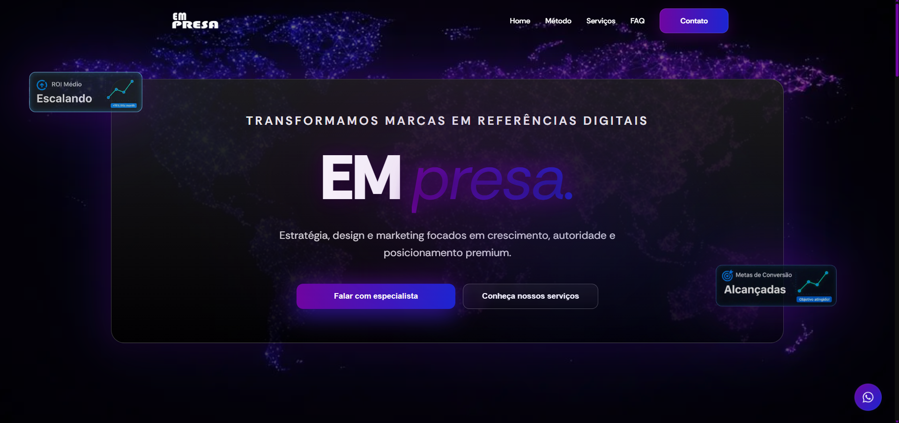

# 🚀 Agência de Marketing Digital — Foco em Conversão

🔗 **Acesse o projeto online:**  
https://landpagereacct.netlify.app/

---

## 📌 Sobre o Projeto

Aplicação web moderna desenvolvida em **React**, criada para apresentar os serviços de uma agência de marketing digital com foco total em:

- 📈 Performance
- 🎯 Geração de leads
- 💰 Aumento de conversão

O projeto foi construído com **arquitetura escalável**, componentização reutilizável e foco em **UX estratégica**, garantindo alta performance e experiência fluida.

---

## ✨ Funcionalidades

- 📈 Seção de serviços com foco em conversão  
- 🎥 Área dedicada a criativos e vídeos de alta performance  
- 🧠 Estrutura orientada a gatilhos mentais e prova social  
- 📊 Seção estratégica para apresentação de resultados e métricas  
- 📱 Totalmente responsivo (desktop, tablet e mobile)  
- ⚡ Carregamento otimizado  
- 🎯 Call-to-Actions estrategicamente posicionados  

---

## 🧩 Tecnologias Utilizadas

- **React** — Construção da interface  
- **Vite / Create React App** — Ambiente de desenvolvimento  
- **JavaScript (ES6+)** — Lógica e interatividade  
- **CSS3 / Styled Components / Tailwind** — Estilização moderna e responsiva  
- **React Hooks** — Gerenciamento de estado  
- **React Router** — Navegação entre páginas  
- **Deploy via Netlify**  

---

## 🎯 Estratégia do Projeto

O site foi desenvolvido com foco em:

- Estrutura persuasiva (copy orientada à conversão)  
- Hierarquia visual clara  
- Design escuro moderno (Dark UI)  
- Prova social e autoridade  
- Destaque para criativos e vídeos estratégicos  
- Experiência centrada no usuário  

Cada seção foi planejada para conduzir o visitante até a ação principal:

> **Solicitar contato ou orçamento**

---

## 📊 Estrutura de Seções

- ✔️ Hero Section com proposta de valor clara  
- ✔️ Serviços principais  
- ✔️ Criativos/Vídeos focados em vendas  
- ✔️ Diferenciais competitivos  
- ✔️ Prova social / números da agência  
- ✔️ Call-to-Action final  

---

## 📱 Responsividade

- Layout flexível e adaptável  
- Interface otimizada para dispositivos móveis  
- Elementos clicáveis com boa área de toque  
- Performance mantida em conexões móveis  

---

## 🧠 Conceito

Projeto desenvolvido com foco em:

- Marketing orientado a dados  
- Design estratégico  
- Performance e escalabilidade  
- Componentização limpa e reutilizável  
- Estrutura preparada para integração futura com backend ou CMS  

---

## 🔮 Possíveis Evoluções

- Integração com CRM  
- Área administrativa  
- Blog com SEO otimizado  
- Integração com Meta Ads / Google Ads API  
- Dashboard de métricas  

---

## 📈 Objetivo

Construir uma estrutura digital capaz de gerar:

- Leads qualificados  
- Conversão previsível  
- Crescimento sustentável  

---

Desenvolvido com foco em **conversão, performance e crescimento previsível**.